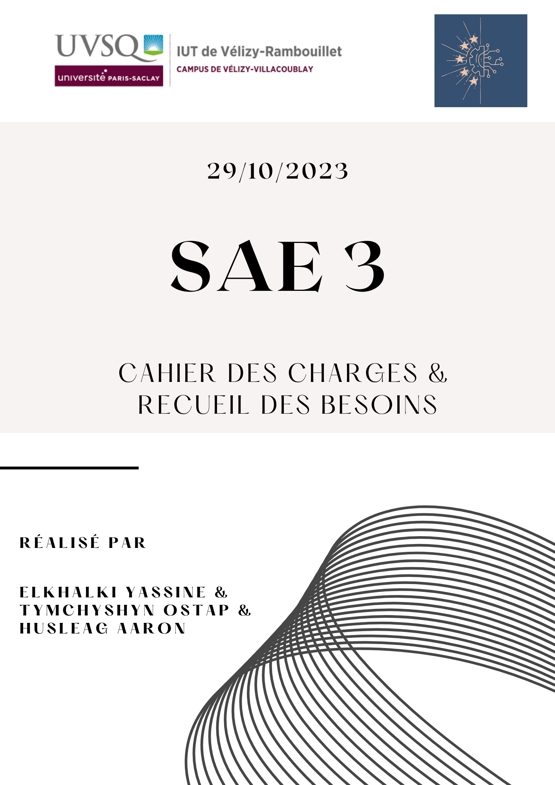

# Sommaire
1. [Introduction](#Introduction)
    * Analyse des besoins du client
    * Objectifs
    * Acteurs de l'application
2. [Glossaire](#Glossaire)
3. [Besoins fonctionnels](#Besoins-fonctionnels)
4. [Besoins non fonctionnels](#Besoins-non-fonctionnels)
5. [Cas d'utilisations](#Cas-d'utilisations)
6. [Contraintes techniques](#Contraintes-techniques)
7. [Gestion de projet](#Gestion-de-projet)
    * Planning
    * Liste des tâches et durée minimale du projet
    * Rôles et Responsabilités
    * Planification dans le temps
8. [Conclusion](#Conclusion)
9. [Annexes](#Annexes)
    * Annexe 1 : diagrammes des cas d'utilisation
    * Annexe 2 : diagramme de PERT
    * Annexe 3 : Liste des actions (Analyse des besoins du client)

# Introduction

>Ce document regroupe le cahier des charges aibqi que le recueil des besoins de la SAE du
>troisième semestre de BUT informatique. Cette SAE concerne la création d’une
>plateforme de ticketing interne demandée par notre client, M. Hoguin.
>Cette plateforme sera réalisée par notre équipe qui est composée de trois étudiants
>en deuxième année de formation.

### Analyse des besoins du client (***Première lecture du cahier des charges***)

>Explications : La première lecture du cahier des charges est une étape
>essentielle au démarrage de ce projet. En effet, cela correspond au moment où nous avons pris connaissance
>du cahier des charges (client) pour la première fois. Cette étape nous a permis de mettre en évidence :
>1. Les objets : référence aux entités/composantes qui jouent un rôle essentiel dans le fonctionnement de la plateforme de ticketing
>2. Les acteurs : référence aux individus/rôles qui sont impliqués dans le fonctionnement de la plateforme de ticketing
>3. Les actions : référence aux tâches/opérations/interactions qui sont à accomplir pour le bon fonctionnement de la plateforme de ticketing ***(Cette partie se trouve en ANNEXE 3)***

<table>
  <tr>
    <th>Objets</th>
    <th>Acteurs</th>
  </tr>
  <tr>
    <td>Application de gestion de ticketing interne</td>
    <td>- Étudiants (participants au projet)</td>
  </tr>
  <tr>
    <td>Page d'accueil de la plateforme</td>
    <td>- Professeurs</td>
  </tr>
  <tr>
    <td>Utilisateur inscrit</td>
    <td>- Client (éventuellement)</td>
  </tr>
  <tr>
    <td>Visiteur</td>
    <td>- M. Hoguin (pour la configuration réseau)</td>
  </tr>
  <tr>
    <td>Administrateur système</td>
    <td>- Utilisateurs inscrits</td>
  </tr>
  <tr>
    <td>Administrateur WEB</td>
    <td>- Administrateur système</td>
  </tr>
  <tr>
    <td>Techniciens</td>
    <td>- Administrateur web</td>
  </tr>
  <tr>
    <td>Tickets de dépannage</td>
    <td>- Techniciens</td>
  </tr>
  <tr>
    <td>Libellés de problèmes</td>
    <td>- Visiteurs</td>
  </tr>
  <tr>
    <td>Statuts des tickets</td>
    <td></td>
  </tr>
  <tr>
    <td>Niveaux d’urgence</td>
    <td></td>
  </tr>
  <tr>
    <td>Journaux d’activités</td>
    <td></td>
  </tr>
  <tr>
    <td>Historique des tickets</td>
    <td></td>
  </tr>
  <tr>
    <td>Serveur basé sur RPI4</td>
    <td></td>
  </tr>
  <tr>
    <td>Carte SD</td>
    <td></td>
  </tr>
  <tr>
    <td>Compte GitHub (ou GitLab selon l'énoncé)</td>
    <td></td>
  </tr>
  <tr>
    <td>Communication par email</td>
    <td></td>
  </tr>
</table>

### Objectifs

>L’objectif de la SAE est le suivant ; il faudra créer et mettre en service
>une application web qui représentera la plateforme de ticketing interne de l’IUT.
>Cette application sera installée dans les salles machines et permettra aux étudiants
>et aux professeurs de déposer des demandes de dépannage.

### Acteurs de l'application

>Également, l’application web comportera différents acteurs dont :
>>* Un administrateur web
>>* Un administrateur système
>>* Un ou plusieurs techniciens
>>* Un visiteur
>>* Un utilisateur inscrit

# Glossaire

Le glossaire est un recueil de termes, expressions ou mots spécifiques/technique d'un 
domaine particulier, accompagnés de leurs définitions, conçu pour aider les 
lecteurs à comprendre et à interpréter le langage technique ou spécialisé 
utilisé dans ce domaine. Il sert de référence rapide pour clarifier le sens 
de ces termes, ce qui facilite la communication et la compréhension 
mutuelle au sein d'une communauté ou d'un contexte particulier. Le glossaire
est souvent utilisé dans des documents techniques, des manuels, des ouvrages
académiques, des sites web ou d'autres supports où une terminologie précise 
est essentielle pour la compréhension.

>1. **SAE (Système d'Assistance à l'Enseignement)** : Un système visant à soutenir l'enseignement.
>2. **BUT informatique** : Référence à la filière universitaire ou au diplôme.
>3. **Plateforme de ticketing interne** : Système de gestion des demandes de dépannage interne.
>4. **Tickets** : Demande de dépannage rpovenant d'un utilisateur de la plateforme pouvant concerner un materiel ou un service.
>5. **Entités/Composantes** : Les objets ou éléments importants dans le fonctionnement de la plateforme.
>6. **Acteurs** : Les individus ou rôles impliqués dans le fonctionnement de la plateforme.
>7. **Actions** : Les tâches, opérations ou interactions nécessaires pour le bon fonctionnement de la plateforme.
>8. **HTML (Langage de balisage)** : Utilisé pour créer des pages web.
>9. **PHP (Langage de programmation)** : Utilisé pour créer des pages web interactives.
>10. **SQL (Langage de requêtes)** : Utilisé pour gérer les bases de données.
>11. **WCAG (Web Content Accessibility Guidelines)** : Directives pour l'accessibilité des contenus web.
>12. **GitLab/GitHub** : Plateforme de gestion de dépôts Git en ligne
>13. **Git** : Un système de contrôle de version largement utilisé pour le suivi des modifications apportées au code source d'un projet logiciel.
>14. **Serveur basé sur RPI4 (Raspberry Pi 4)** : Utilisé comme serveur pour héberger l'application.
>15. **Carte SD** : Une carte mémoire pour le stockage.
>16. **RGPD (Règlement Général sur la Protection des Données)** : Réglementation de l'Union européenne concernant la protection des données personnelles.
>17. **Méthode Agile** : Méthodologie de gestion de projet favorisant la collaboration et l'adaptation aux changements.
>18. **Diagramme de Gantt** : Outil de gestion de projet représentant graphiquement les tâches et leur chronologie.
>19. **Diagramme de PERT (Program Evaluation and Review Technique)** : Outil de gestion de projet pour analyser les dépendances entre les tâches et estimer la durée totale du projet.
>20. **GitLab/GitHub** : Plateforme de gestion de code source utilisée pour héberger le code et la documentation du projet.
>21. **Gestion des Risques** : Le processus d'identification, d'évaluation et de gestion des risques potentiels associés au projet.
>22. **Besoins Fonctionnels** : Exigences spécifiques concernant les fonctions, les capacités ou les caractéristiques qu'un système, un logiciel ou un produit doit offrir pour satisfaire aux objectifs d'un utilisateur ou d'un client.
>23. **Besoins Non Fonctionnels** : Exigences qui définissent la qualité, la performance et les caractéristiques non directement liées à une fonctionnalité spécifique.
>24. **Cas d'Utilisation** : Descriptions détaillées des interactions entre les utilisateurs et un système ou une application.
>25. **Contrainte Technique** : Une contrainte technique est une limitation ou une exigence imposée par des contraintes matérielles, logicielles, budgétaires ou de toute autre nature qui influence la conception, le développement ou la mise en œuvre d'un système ou d'un projet. Ces contraintes guident les choix et les décisions pour atteindre les objectifs du projet malgré les limitations spécifiques imposées.

# Besoins fonctionnels

>### 1) Création de tickets :
>>L'application web "Plateforme de ticketing interne" vise à satisfaire les besoins
>>des utilisateurs comme : les visiteurs, les utilisateurs inscrits, les administrateurs web,
>>les techniciens, et finalement l'administrateur système. Les visiteurs ont un accès
>>restreint à la page d'accueil informative, sans fonctionnalités de soumission de
>>demandes de dépannage. En revanche, les utilisateurs inscrits, après une simple
>>inscription sans confirmation par e-mail, disposent de la capacité de créer des tickets de dépannage.
>>Ces tickets incluent des détails comme la nature du problème, le niveau d'urgence
>>estimé, les informations du demandeur, ainsi que celles de la personne concernée par le problème.
>>Enfin, les utilisateurs inscrits ont accès à leur tableau de bord pour suivre l'évolution de leurs demandes,
>modifier leur mot de passe, et communiquer avec les techniciens assignés à leurs tickets.

>### 2) Gestion des tickets :
>>Les administrateurs web, au nombre limité, assument un rôle essentiel dans la gestion
>globale de la plateforme. Ils ont la responsabilité de gérer les libellés associés aux
>problèmes, de définir les états des tickets (ouvert, en cours de traitement, fermé),
>et de préciser les niveaux d'urgence (de 4 pour faible à 1 pour urgent). Cependant,
>ils sont chargés de créer des comptes pour les techniciens, dont les identifiants par
>défaut sont tec1 et tec2, accompagnés du mot de passe "tec". Les administrateurs web
>se connectent à la plateforme pour effectuer ces tâches administratives et ont la
>possibilité de visualiser les tickets en état ouvert,et peuvent les affecter à un
>technicien (important pour la réponse rapide aux demandes de dépannage).

>### 3) Communication, suivi et sécurité des données :
>>La plateforme de ticketing assure une communication fluide et transparente entre
>les utilisateurs, ce qui favorise la collaboration pour une résolution efficace des
>problèmes. Le suivi se fait grâce à des journaux d'activité enregistrant les actions
>effectuées, y compris la création, l'évolution et l'attribution des tickets, ainsi que
>les tentatives de connexion infructueuses. Ces données sont utilisées pour les  
>statistiques et la sécurité, conformément aux normes de cryptographie et aux
>meilleures pratiques en matière de sécurité des systèmes d'information. Cela permet
>de préserver la confidentialité des données et de garantir la sécurité globale de la
>plateforme qu’on crée.

# Besoins non fonctionnels

>### 1) Fiabilité et stabilité du système :
>>La fiabilité de la plateforme de ticketing interne est essentielle pour garantir
>une expérience utilisateur sans heurts. Il est primordial que le système fonctionne
>de manière stable, en minimisant les pannes inattendues susceptibles de perturber
>la soumission des demandes de dépannage. Pour atteindre cet objectif, des tests
>approfondis et des mécanismes de surveillance en temps réel seront mis en place.
>La plateforme inclut également des sauvegardes régulières des données pour
>prévenir toute perte de données en cas de défaillance.

>### 2) Facilité d'utilisation et interface conviviale :
>>La facilité d'utilisation, ou utilisabilité, est un aspect clé de la plateforme.
>L'inscription des utilisateurs sera simplifiée, avec un processus convivial qui
>ne nécessite pas de confirmation par e-mail. De plus, l'interface utilisateur
>sera conçue pour être intuitive, offrant une navigation fluide pour les visiteurs
>et les utilisateurs inscrits. Une vidéo de démonstration sur la page d'accueil
>aidera également les utilisateurs à comprendre rapidement comment utiliser
>l'application.

>### 3) Rendement et efficacité
>>Le rendement de la plateforme sera un élément essentiel pour garantir une
>expérience utilisateur efficace. Les temps de réponse seront rapides pour
>toutes les opérations, de la création des tickets à leur gestion. Les processus
>internes de gestion des tickets seront optimisés pour garantir une résolution
>rapide des problèmes. De plus, l'application sera spécifiquement optimisée pour
>fonctionner efficacement sur le serveur Raspberry Pi 4, tout en maintenant de
>bonnes performances.

>### 4) Maintenabilité et documentation
>>La maintenabilité de l'application sera assurée grâce à une documentation
>complète disponible sur Gitlab. Cette documentation expliquera en détail les
>procédures d'installation du système et des services associés. Le code source
>sera organisé de manière à faciliter les mises à jour futures, et un mécanisme
>de gestion des erreurs sera mis en place pour faciliter le débogage et la
>maintenance

# Cas d'utilisations

>Un cas d'utilisation est une représentation, soit sous forme de texte (***voir tableau ci-dessous***, soit sous
>forme graphique (***voir annexes***), qui décrit de manière détaillée comment un système informatique
>interagit avec ses utilisateurs dans un contexte spécifique. Il décrit les acteurs
>impliqués, les actions effectuées et les résultats attendus de manière à spécifier
>les fonctionnalités et le comportement d'une application.
>
>Les cas d'utilisation sont un outil indispensable pour le génie logiciel afin de
>décrire et analyser les interactions entre un système informatique et ses
>utilisateurs.

### Tableau des cas d'utilisations

<table>
  <tr>
    <th>Cas</th>
    <th>Acteur(s)</th>
    <th>Nom</th>
    <th>Scénario</th>
    <th>Niveau</th>
    <th>Portée</th>
  </tr>
  <tr>
    <td>Cas 1</td>
    <td>Administrateur Web, Techniciens</td>
    <td>Gestion des tickets</td>
    <td>L’administrateur web gère : les statuts, les libellés, les niveaux d’urgence. Les techniciens peuvent attribuer des tickets, prendre en charge des tickets</td>
    <td>Objectif sous-fonctions</td>
    <td>Administrateur Web, Techniciens</td>
  </tr>
  <tr>
    <td>Cas 2</td>
    <td>Administrateur Web</td>
    <td>Création des techniciens</td>
    <td>L’administrateur web créé les techniciens en remplissant un formulaire (identifiant, mot de passe, ...)</td>
    <td>Objectif stratégique(1)</td>
    <td>Administrateur Web</td>
  </tr>
  <tr>
    <td>Cas 3</td>
    <td>Administrateur Web</td>
    <td>Visualisation des tickets ouverts</td>
    <td>L’administrateur web visualise les tickets ouverts.</td>
    <td>Objectif Sous-fonctions</td>
    <td>Administrateur Web</td>
  </tr>
  <tr>
    <td>Cas 4</td>
    <td>Administrateur Web, Techniciens, Utilisateurs inscrits, Administrateur système</td>
    <td>Authentification à l’application</td>
    <td>Ces quatre utilisateurs peuvent se connecter/déconnecter de l'application (contrairement au visiteur).</td>
    <td>Objectif utilisateur</td>
    <td>Administrateur Web, Techniciens, Utilisateurs inscrits, Administrateur système</td>
  </tr>
  <tr>
    <td>Cas 5</td>
    <td>Utilisateur inscrit</td>
    <td>Création de ticket</td>
    <td>Un utilisateur inscrit peut créer (ouvrir) un ticket.</td>
    <td>Objectif utilisateur</td>
    <td>Utilisateur inscrit</td>
  </tr>
  <tr>
    <td>Cas 6</td>
    <td>Visiteur</td>
    <td>Inscription sur l’application</td>
    <td>Avant d’être considéré comme un utilisateur inscrit, l’utilisateur doit s’inscrire via un formulaire. Le visiteur devient donc un utilisateur inscrit</td>
    <td>Objectif stratégique(2)</td>
    <td>Visiteur, Utilisateur inscrit</td>
  </tr>
  <tr>
    <td>Cas 7</td>
    <td>Visiteur</td>
    <td>Visionnage du site</td>
    <td>Un visiteur peut visionner la page d’accueil de l’application.</td>
    <td>Objectif utilisateur</td>
    <td>Visiteur</td>
  </tr>
  <tr>
    <td>Cas 8</td>
    <td>Administrateur système</td>
    <td>Visionnage des journaux d’activités</td>
    <td>L’administrateur système peut accéder aux journaux d’activité de l’application web.</td>
    <td>Objectif utilisateur</td>
    <td>Administrateur système</td>
  </tr>
</table>

***(1) : Ce cas d'utilisation est de niveau "Objectif stratégique" car il soutient un objectif stratégique du projet qui est la gestion efficace des techniciens qui seront responsables de la prise en charge des tickets de dépannage.***

***(2) : Ce cas d'utilisation est de niveau "Objectif stratégique" car offrir la possibilité à un visiteur de s'incrire permettre à notre client d'avoir plus de clients.***

#### Explications du tableau
>* Acteur(s) : Liste des acteurs qui sont concernés par le cas d'utilisation.
>* Nom : Nom du cas d'utilisation.
>* Scénario : Déroulement du cas d'utilisation.
>* Niveau : Classifications permettant de définir l'importance et la portée de chaque cas. Le niveau "Objectif Utilisateur" se concentre sur les besoins des utilisateurs finaux, le niveau "Objectif Stratégique" aligne les cas sur les objectifs globaux de l'entreprise, et le niveau "Objectif Sous-fonctions" détaille des aspects techniques internes.
>* Portée : La portée permet de définir les autorisations et les responsabilités de chaque acteur dans le cadre du cas d'utilisation et plus généralement, dans le contexte de l'application.

# Contraintes techniques

>Avant de lister l’ensemble des contraintes techniques auxquelles nous ferons
>face, on peut commencer par rappeler sa définition : Une contrainte technique est
>une donnée ou une condition à prendre en considération au moment  de la conception
>ou réalisation d'une solution à un problème. Ces contraintes peuvent être multiples,
>les exemples les plus courants dans le développement d’application sont les
>contraintes de temps ou d’exigences. Voici la liste des diverses contraintes
>techniques que l’on peut rencontrer :
>
>>1. Langages de programmation : Parmi les langages que nous sommes contraints
     d’utiliser, on peut citer le PHP qui sera là pour nous permettre de créer des
     pages web interactives avec l’utilisateur, et pourra aussi nous être utile
     pour générer des pages différentes en fonction de l’utilisateur. En parallèle
     nous utiliserons aussi le HTML pour la structure de nos diverses pages web.
     Le SQL pour la gestion de la base de données.
>>2. Plateformes et environnement de développement : Nous développerons le code PHP,
     et HTML sur les applications Jetbrains telles que PHPStorm disponible sur
     windows/Linux en revanche notre serveur et notre application sera bel et bien
     fonctionnel et aussi paramétré sur linux.
>>3. Accessibilité : Notre application respectera les exigences d'accessibilité
     conformément aux normes comme le WCAG. De ce fait, notre site sera accessible et
     utilisable par bien plus de monde.
>>4. Documentation : La documentation sera également présente et fournie. Notre
     documentation se compose de manuels d'utilisation et de guides de développement.
>>5. Normes de codage et de qualité : En fonction des langages utilisés nous appliquerons
     les normes de codages qui concernent ces mêmes langages.
>>6. Contraintes matérielles : La seule exigence qui mentionne l’utilisation d’un
     matériel est celle qui mentionne l’utilisation d’une carte SD qui stockera le
     serveur, l’application, le serveur SGBD, voire plus.
>>7. Calendrier : Nous avons des contraintes de temps en ce qui concerne ce projet. Elles sont
     détaillées dans la partie Gestion de projet (voir planning).
>>8. Méthode utilisé :  Nous utiliserons comme méthode de développement : la
     méthode agile. L'application d'une méthode agile pour un projet informatique
     est avantageuse sur plusieurs plans, notamment : la flexibilité, la collaboration,
     la satisfaction client, la gestion du risque, l'efficacité et la qualité,
     ce qui en fait une méthode intéressante pour de nombreux projets informatiques.
     (cf ***Gestion de projet > planification dans le temps***)
>
> Le fait de lister ces nombreuses contraintes nous permet de créer une base solide
>à fin de mieux comprendre les besoins du projet. De plus, l'énumération nous a
>aussi permis d’identifier et prendre en compte les contraintes techniques dès le
>départ ce qui contribue à à minimiser les risques en ce qui concerne les retards
>et les potentiels problèmes techniques majeurs en cours de projet. Cela favorise
>une gestion plus efficace des risques.

# Gestion de projet

### Planning

>Ce projet a commencé par la rédaction de ce cahier des charges la semaine du 18 septembre.
>De plus, notre client nous a exigé certaines échéances telles que :
>
>>* Livraison du cahier des charges : semaine du 2 octobre
>>* Argumentaire du logo + site HTML statique : semaine du 9 octobre
>>* Livraison de la carte SD : semaine du 23 octobre
>>* du 6 novembre au mois de janvier :
>>>* Organisation et réalisation des différents sprints pour la mise en place des modules de l'application web
>>>* Exposé à présenter en anglais
>>>* Travail à remettre en probabilités/statistiques
>>>* Travail à remettre en cryptographie
>>>* Travail à remettre dans le cadre de la RGPD
>>>* Travail à remettre pour la gestion des risques
>>* Livraison du projet : mois de janvier
>>* Soutenance de projet : mois de janvier

### Lise des tâches et durée minimale du projet

>Grâce au planning ci-dessus et au cahier des charges (client), nous avons fait la liste des tâches
>à faire pour réaliser ce projet et avons établit une matrice des antécédents.

#### Matrice des antécédents

***Note : Les matrices des antécédents sont un outil de gestion de projet qui permet de représenterles relations et dépendances entre les tâches d'un projet***

<table style="width: 100%;">
  <thead>
    <tr>
      <th style="width: 20%;">Tâches</th>
      <th style="width: 15%;">Durée (jours)</th>
      <th style="width: 10%;">Niveau</th>
      <th style="width: 55%;">Antécédents</th>
    </tr>
  </thead>
  <tbody>
    <tr>
      <td>t1. Lancement du projet</td>
      <td>1</td>
      <td>1</td>
      <td>-</td>
    </tr>
    <tr>
      <td>t2. Analyse des besoins du client</td>
      <td>10</td>
      <td>2</td>
      <td>(début 1 jour après t1)</td>
    </tr>
    <tr>
      <td>t3. Réécriture du cahier des charges</td>
      <td>10</td>
      <td>3</td>
      <td>(début 1 jour après t2)</td>
    </tr>
    <tr>
      <td>t4. Création + Argumentaire du logo du groupe</td>
      <td>7</td>
      <td>4</td>
      <td>(début 1 jour après t3)</td>
    </tr>
    <tr>
      <td>t5. Création du site HTML statique</td>
      <td>7</td>
      <td>4</td>
      <td>(début 1 jour après t3)</td>
    </tr>
    <tr>
      <td>t6. Point individuel sur l'investissement</td>
      <td>3</td>
      <td>5</td>
      <td>t4 et t5</td>
    </tr>
    <tr>
      <td>t7. Préparation et livraison des cartes SD</td>
      <td>7</td>
      <td>6</td>
      <td>t6</td>
    </tr>
    <tr>
      <td>t8. Conception + Création de la base de données</td>
      <td>10</td>
      <td>6</td>
      <td>(début 1 jour après t6)</td>
    </tr>
    <tr>
      <td>t9. Premier point intermédiaire</td>
      <td>3</td>
      <td>7</td>
      <td>t7 (début 5 jours après le début de t8)</td>
    </tr>
    <tr>
      <td>t10. Conception et création des pages PHP/HTML</td>
      <td>21</td>
      <td>8</td>
      <td>t9 et t8 (début 1 jour après t9)</td>
    </tr>
    <tr>
      <td>t11. Présentation en anglais</td>
      <td>5</td>
      <td>8</td>
      <td>t9 (début 6 jours après le début de t10)</td>
    </tr>
    <tr>
      <td>t12. Travail en proba-stats</td>
      <td>5</td>
      <td>8</td>
      <td>t9 (début 6 jours après le début de t10)</td>
    </tr>
    <tr>
      <td>t13. Travail en sécurité</td>
      <td>5</td>
      <td>8</td>
      <td>t9 (début 6 jours après le début de t10)</td>
    </tr>
    <tr>
      <td>t14. Travail sur la RGPD (droit)</td>
      <td>5</td>
      <td>8</td>
      <td>t9 (début 6 jours après le début de t10)</td>
    </tr>
    <tr>
      <td>t15. Travail sur la gestion des risques</td>
      <td>5</td>
      <td>8</td>
      <td>t9 (début 6 jours après le début de t9)</td>
    </tr>
    <tr>
      <td>t16. Deuxième point intermédiaire</td>
      <td>3</td>
      <td>9</td>
      <td>t10,t11,t12,t13,t14 et t15</td>
    </tr>
    <tr>
      <td>t17. Finalisation du projet</td>
      <td>7</td>
      <td>10</td>
      <td>t16 (début 1 jour après t16)</td>
    </tr>
    <tr>
      <td>t18. Préparation de la documentation</td>
      <td>(tout au long du projet)</td>
      <td>2</td>
      <td>t1</td>
    </tr>
    <tr>
      <td>t19. Présentation finale</td>
      <td>5</td>
      <td>11</td>
      <td>t17 (début 1 jour après t17)</td>
    </tr>
  </tbody>
</table>

>Cette matrice des antécédents nous a permis de réaliser un diagramme de PERT (voir annexes). Ce diagramme est un outil de gestion de projet
>qui nous a permis de mettre en évidence les dépendances entre les tâches et d'identifier les tâches critiques (ici : t1,t18,t8,t10,t16,t17 et t19).
>Ce diagramme nous a également permis d'estimer une durrée pour le projet qui est de 83 jours.

### Rôles et Responsabilités

>Pour ce projet, les tâches seront réparties entre les trois membres du groupe et chacun
>des membres contribuera activement à l'ensemble des tâches. Néanmoins, si nous devions attribuer
>des responsabilités précises à chaque membre, voici la répartition.
>
>>Yassine sera :
>>* Chef de projet (Yassine devra planifier, coordonner et superviser la réalisation du projet)
>>* Développeur back-end (Yassine devra concevoir et développer la logique et la base de donénes de l'application web)
>>* Administrateur système et déploiement (C'est principalement Yassine qui s'occupera de la configuration du serveur et du système)
>
>>Ostap sera :
>>* Développeur front-end (Ostap mettra en oeuvre une interface utilisateur conviviale et attrayante)
>>* Responsable de la base de données (Ostap devra gérer, sécuriser et optimiser la base données que nous allons concevoir pour cette application web)
>
>>Aarron sera :
>>* Responsable de la sécurité de l'application (C'est principalement Aarron qui devra identifier et évaluer les failles de sécurités afin de garantir la protection des données)
>>* Testeur (Aarron devra s'assurer que les fonctionnalités exigées par le client sont opérationnelles)
>>* Responsable de la qualité (Aarron devra également s'assurrer que les normes de qualités sont respectée tout au long de la réalisation du projet)
>
>>Les autres rôles tel que responable de la documentation, intégrateur git, ... auraient été réalisé par les trois membres du groupe
>
>***Important : Dans le cas de ce projet, il faut bien prendre en compte que tout les rôles seront sous la responsabilité de tout les membres !***

### Planification dans le temps

>Il nous a également été demandée d'estimer une planification de notre projet. ainsi, nous proposons donc ce diagramme de GANTT qui est un outil de gestion de projet
>qui représente les échéances et permet de visualiser la planification temporelle.

#### Diagramme de GANTT

>On peut remarquer que la durée de projet tombe à 52 (au lieu de 83). Cela est due au fait que cette planification correspond à une planification où toutes les
>tâches sont faites au plus tôt et que tout notre temps est consacré à la réalisation du projet. Il faudra prendre en compte que les membres du groupe suivent des
>cours et ont d'autres engagements parallèle. Ce qui signifie que la disponibilité des ressources est limitée.
>
>Cette planification a également été faite en prenant en compte la méthode agile que nous allons utiliser. En effet, par exemple, si la tâche 14 est demandée avant la
>tâche 12, ces dernières pourront s'intervertir, ce qui permettra une livraison des livrables en temps et en heure.

# Conclusion

>En conclusion, ce cahier des charges représente une étape importante dans la
>planification et la gestion d’un projet. L’objectif de ce cahier des charges est
>de définir clairement les objectifs, les exigences et les contraintes qui nous
>mèneront à la réalisation de ce projet. En le suivant rigoureusement, nous sommes
>convaincus que nous serons en mesure de développer le projet de  manière à ce
>qu’il réponde pleinement aux attentes de notre client. Ce cahier des charges
>risque d’évoluer avec le temps puisqu’on recevra, sans aucun doute, des
>indications concernant certains éléments. Nous tâcherons aussi de communiquer
>souvent avec le client afin qu’il puisse nous faire connaître ses attentes le
>mieux possible. En faisant preuve de sérieux dans l'exécution, en gérant de
>manière efficace les différentes tâches, et en restant engagés envers les
>principes énoncés dans ce document, nous sommes convaincus que nous réussirons
>à concrétiser ce projet.

# Annexes

### Annexe 1 : diagrammes des cas d'utilisation

### Annexe 2 : diagramme de PERT

### Annexe 3 : Liste des actions (Analyse des besoins du client) 

- Développer une application de ticketing interne en PHP & MySQL
- Créer une page d'accueil expliquant le but de la plateforme
- Permettre aux utilisateurs inscrits de s'authentifier
- Permettre aux utilisateurs inscrits de soumettre des demandes de dépannage (ouvrir un ticket).
- Permettre aux utilisateurs inscrits de visualiser leur tableau de bord (liste des tickets publiés et leur état).
- Permettre aux utilisateurs inscrits de modifier leur mot de passe.
- Permettre aux visiteurs de visualiser les 10 dernières demandes sur la plateforme
- Permettre à l'administrateur web de gérer les libellés des problèmes.
- Permettre à l'administrateur web de définir les statuts des tickets (ouvert, en cours de traitement, fermé).
- Permettre à l'administrateur web de spécifier les niveaux d'urgence des tickets.
- Créer les comptes des techniciens (tec1 et tec2 par défaut) avec le mot de passe "tec"
- Permettre à l'administrateur web de visualiser les tickets en état ouvert et de les affecter à un technicien.
- Permettre aux techniciens de s'authentifier
- Permettre aux techniciens de s'attribuer des tickets
- Permettre aux techniciens de changer l'état des tickets.
- Permettre à l'administrateur système d'accéder aux journaux d'activités de l'application web
- Enregistrer les journaux d'activités lors de la validation d'un ticket par un utilisateur
- Enregistrer les journaux d'activités en cas de tentative de connexion infructueuse sur la plateforme
- Stocker les tickets fermés dans un historique
- Installer l'application sur un serveur basé sur RPi4 accessible en SSH depuis les postes des salles machines
- Préparer la carte SD avec le système, un serveur web (comme Apache), et un serveur SGBD (comme MySQL).
- Configurer le réseau du RPi4 par M. Hoguin
- Créer un compte GitLab pour chaque groupe et partager la documentation, le code, et d'autres informations relatives au projet
- Communiquer par e-mail avec les clients (le cas échéant)
- Réécrire le cahier des charges après avoir étudié le sujet et posé des questions
- Réaliser une maquette web en HTML.
- Expliquer le choix du logo
- Préparer un exposé en anglais
- Fournir des dossiers de conception
- Documenter les procédures d'installation
- Laisser le code mis à jour sur un dépôt distanciel GIT
- Documenter le code
