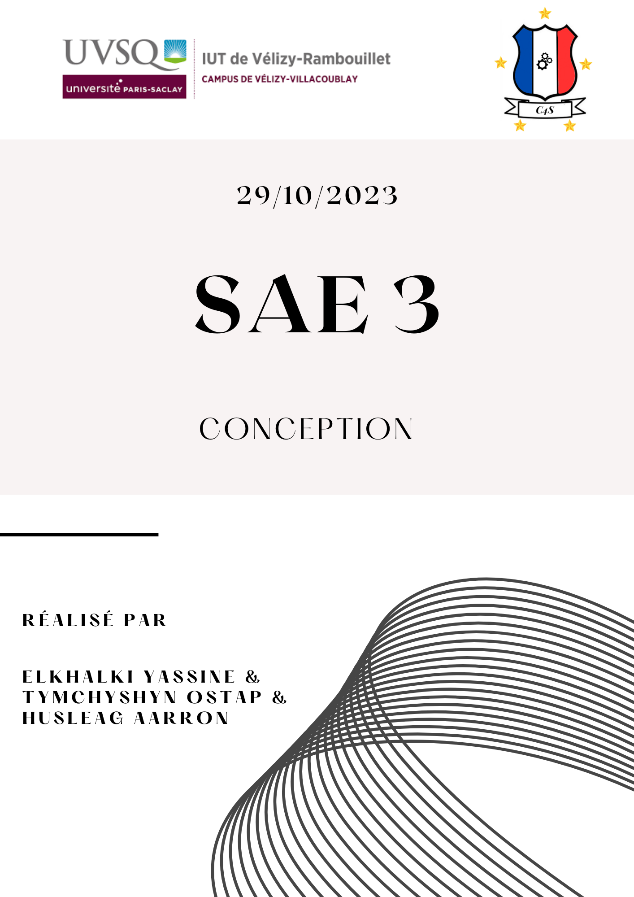

# Sommaire
1. [Introduction](#Introduction)
2. 
   * Contexte
   * Analyse des besoins du client
   * Objectif
2. [Architecture générale](#Architecture-générale)
   * Figure 1 : Schémas de l'architecture générale 
   * Explications
3. [Site web statique](#Site-web-statique)
   * But
   * Maquettes web
4. [Base de données](#Base-de-données)
   * Conception
   * Développement
   * Explications avec exemples
5. [Raspberry PI 4](#Raspberry-PI-4)
   * Fonctionnement 
   * Carte SD 
   * Procédure
6. [Site web dynamique](#Site-web-dynamique)
7. [Annexes]
   * Maquettes web
   

# Introduction

### Contexte
>Ce dossier de conception présente les détails de la conception pour la SAE 
>du troisième semestre du BUT informatique. Le but de la SAE en question est de développer une plateforme 
>de ticketing interne pour les salles informatiques de l'IUT. Cette plateforme a été demandée par notre client, 
>M. Hoguin. La réalisation de cette plateforme est confiée à notre équipe de trois étudiants en deuxième 
>année de formation en informatique.

### Analyse des besoins du client

>L'analyse des besoins du client est une étape importante qui a été menée dans le cahier des charges et le recueil des besoins.
>Cette étape essentielle nous a permis de prendre connaissance des objectifs du client,
>d'identifier les spécificités, et de mettre en lumière les opportunités 
>d'amélioration. En analysant minutieusement les besoins de notre client, nous nous engageons à concevoir 
>une solution parfaitement adaptée aux attentes de notre client. En outre, cette analyse éclairée des besoins 
>nous a aidé à établir des exigences claires, à anticiper les risques et à optimiser l'utilisation 
>de nos ressources. En somme, l'analyse des besoins est le socle sur 
>lequel repose notre démarche de conception, nous guidant vers la réalisation d'une solution qui répondra 
>précisément aux attentes de notre client tout en maximisant l'efficacité du projet.
>  
>  
>Ce travail précédemment réalisé nous a donc permis de mettre en place le tableau ci-dessous qui regroupe les objets
>du problème, leurs états ainsi que leur comportement.

***Remarque : Ici, le domaine du problème est l'application web qui sera la future plateforme de ticketing.***

#### Tableau Objet/Etat/Comportement

<table>
  <tr>
    <th>Objet</th>
    <th>État</th>
    <th>Comportement</th>
  </tr>
  <tr>
    <td>Système informatique</td>
    <td>En développement</td>
    <td>Gestion des interactions avec les utilisateurs, gestion des tickets de dépannage, gestion des acteurs.</td>
  </tr>
  <tr>
    <td>Application web</td>
    <td>En développement</td>
    <td>Interface utilisateur en cours de création, gestion des tickets, gestion des utilisateurs (création de tickets, attribution, mise à jour), gestion des acteurs.</td>
  </tr>
  <tr>
    <td>Utilisateurs</td>
    <td>Actifs (divers rôles)</td>
    <td>Selon leur rôle, ils peuvent se connecter/déconnecter, créer des tickets, attribuer des tickets, gérer des tickets, gérer des comptes, s'inscrire.</td>
  </tr>
  <tr>
    <td>Tickets de dépannage</td>
    <td>Peuvent être en cours, résolus ou en attente</td>
    <td>Création de tickets, attribution à des techniciens, mise à jour de l'état, résolution, suivi de l'avancement.</td>
  </tr>
  <tr>
    <td>Administrateur Web</td>
    <td>Actif</td>
    <td>Gestion des statuts des tickets, gestion des libellés, gestion des niveaux d'urgence, gestion des utilisateurs.</td>
  </tr>
  <tr>
    <td>Techniciens</td>
    <td>Actifs</td>
    <td>Attribution de tickets, prise en charge des tickets, mise à jour des tickets.</td>
  </tr>
  <tr>
    <td>Utilisateur inscrit</td>
    <td>Actif</td>
    <td>Création de tickets, gestion de son propre compte.</td>
  </tr>
  <tr>
    <td>Visiteur</td>
    <td>Actif</td>
    <td>Inscription en tant qu'utilisateur inscrit, visionnage de la page d'accueil.</td>
  </tr>
  <tr>
    <td>Administrateur système</td>
    <td>Actif</td>
    <td>Accède aux journaux d'activités de l'application web.</td>
  </tr>
  <tr>
    <td>Base de données</td>
    <td>Opérationnelle</td>
    <td>Stockage des données relatives aux tickets, utilisateurs, ...</td>
  </tr>
  <tr>
    <td>Serveur APACHE</td>
    <td>Actif</td>
    <td>Hébergement de l'application web, de la base de données.</td>
  </tr>
  <tr>
    <td>Raspberry 4 (RPI4)</td>
    <td>Paramétré par le client</td>
    <td>Support du serveur</td>
  </tr>
  <tr>
    <td>Carte SD</td>
    <td>Stocke l'application</td>
    <td>Devra être insérée dans le RPI4</td>
  </tr>
  <tr>
    <td>Documentation</td>
    <td>En cours de création</td>
    <td>Explique le code, les utilisations, ...</td>
  </tr>
  <tr>
    <td>Normes de codage</td>
    <td>Pour les pages HTML/PHP et le CSS</td>
    <td></td>
  </tr>
  <tr>
    <td>Exigences d'accessibilité</td>
    <td>À respecter</td>
    <td></td>
  </tr>
  <tr>
    <td>Calendrier</td>
    <td>Estimation terminée</td>
    <td>Suivi du planning, gestion des échéances du projet.</td>
  </tr>
</table>

# Architecture générale

>L'architecture générale d'une application web constitue la structure organisationnelle déterminant l'ensemble 
des interactions entre les composants de l'application, dans le but de fournir une expérience utilisateur 
cohérente et opérationnelle. Elle englobe la conception des modules, leur disposition, leurs interrelations, 
ainsi que l'usage de technologies et de normes pour garantir le bon fonctionnement de l'application. 
L'objectif premier de cette architecture est d'assurer la solidité, la sécurité, la facilité de maintenance 
et la capacité d'évolution de l'application, tout en répondant aux besoins spécifiques des utilisateurs. 
Elle constitue le plan directeur qui oriente le développement de l'application web et qui assure la 
coordination de tous les éléments en vue de fournir une expérience utilisateur fluide et fiable.  

### Figure 1 : Shémas de l'architecture générale de l'application web

### Explications de la figure 1 et de l'architecture

>L'architecture repose sur un modèle client-serveur, et le client est l'utilisateur. 
Les utilisateurs interagissent avec l'application en envoyant des requêtes HTTP. Ces requêtes seront reçues 
et traitées par le serveur web Apache, qui utilise le langage de programmation PHP pour les exécuter. 
PHP communique avec la base de données MySQL pour stocker et récupérer des données.
>
>La base de données MySQL est au cœur de l'application, stockant des informations essentielles telles que 
les utilisateurs, les tickets de dépannage, les journaux d'activité, et plus encore. Parallèlement, 
le journal d'activité enregistre de manière exhaustive toutes les actions effectuées, fournissant un 
historique détaillé.
>
>La gestion des sessions est cruciale pour l'authentification et l'autorisation des utilisateurs, leur 
permettant de rester connectés et de maintenir leur état pendant leur interaction. Cette architecture 
garantit une gestion fluide des requêtes utilisateur, un stockage de données fiable et une sécurité 
renforcée.

# Site web statique
### But

>L'interface utilisateur, dans le cadre du projet de plateforme de ticketing interne, a pour 
rôle de créer une expérience conviviale et interactive pour tous les utilisateurs, qu'ils 
soient administrateurs, techniciens, utilisateurs inscrits ou visiteurs. En résumé, elle 
permet de simplifier la soumission des demandes de dépannage, la gestion des requêtes, 
la supervision administrative, le travail des techniciens, l'accès aux informations pour 
les visiteurs, ainsi que la mise à disposition de ressources explicatives. Elle joue un 
rôle central pour garantir que le processus de ticketing interne soit efficace, transparent 
et accessible à tous les utilisateurs.

***Important : Pour le site web, il a été jugé inutile de fournir un diagramme UML. Néanmoins, il sera fait et disponible avant le développement du site web dynamique***  

***Note : Vous pouvez consulter les tests d'acceptation dans le dossier de test ([Tests.md](Tests.md))***

### Maquettes web
***Note : Toutes les maquettes web sont réalisées avec le logiciel en ligne lucidspark.***

>**Page d'accueil :** Le rôle principal de la page d'accueil dans le contexte de la plateforme de 
ticketing interne est de fournir aux utilisateurs des informations essentielles sur le fonctionnement
de l'application et de les orienter vers les actions qu'ils peuvent entreprendre. En bref, la 
page d'accueil vise à :  
>* Expliquer le service
>* Faciliter la navigation
>* Promouvoir la vidéo de démonstration
>* Offrir un accès aux ressources
>* Présenter l'application
>  
> La page d'accueil se doit donc d'être informative et conviviale, mais aussi, elle doit être axée sur l'action.

>**Page de connexion :** La page de connexion, bien qu'étant un formulaire simple, est très importante pour l'application.
En effet, celle-ci permettra aux utilisateurs d'accéder à leur profil et ils ne devront rencontrer aucun problème !
  

***Note : Afin de consulter les maquettes des pages web pour la communication, veuillez consulter les annexes de ce dossier***  
***Note : Les autres maquettes seront faites et proposées au client ultérieurement***

# Base de données
## ***REMARQUE :*** *Pour le moment, la base de données contient uniquement une seule table utilisateurs avec l'administrateur web !*

# Raspberry PI 4

### Fonctionnement

>Pour ce projet, il nous a été demandé de fournir une carte SD qui contiendra les éléments suivants :
>1. **Raspberry PI OS :** Le système d'exploitation 
>2. **APACHE :** Le serveur WEB qui permettra de démarrer l'application
>3. **Le code source :** Afin de pouvoir avoir accès à l'application

## ***A compléter !!!***

# Carte SD

Nous fournissons une carte SD préparée pour être insérée dans le Raspberry Pi 4. Une fois la carte SD installée, notre équipe aura un accès sécurisé via un tunnel SSH (Secure Shell) pour effectuer des mises à jour du code source directement depuis les machines de l'IUT. Cette configuration permet une gestion aisée de l'application et garantit que les dernières mises à jour et améliorations peuvent être appliquées en toute simplicité. Notre objectif est de simplifier le processus d'installation et de maintenance de l'application, offrant ainsi une expérience agréable à notre client.

## ***A compléter !!!***
# Annexes 

