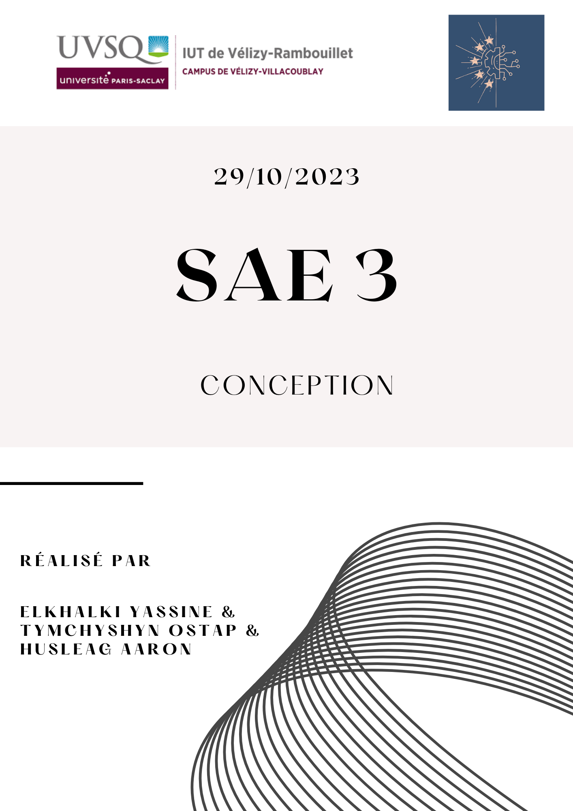

# Sommaire
1. [Introduction](#Introduction)
   * Contexte
   * Analyse des besoins du client
3. [Architecture générale](#Architecture-générale)
   * Figure 1 : Schémas de l'architecture générale 
   * Explications
4. [Site web statique](#Site-web-statique)
   * But
   * Maquettes web
   * DOM page d'accueil
5. [Base de données](#Base-de-données)
   * Conception
   * Développement
   * Explications avec exemples
6. [Raspberry PI 4](#Raspberry-PI-4)
   * Fonctionnement 
   * Carte SD 
   * UML composantes connecteurs
7. [Site web dynamique](#Site-web-dynamique)
   * Adaptation du site statique
   * Langages de programmation
   * Sécurité
   * Gestion des erreurs
   * Gestion des sessions
   * Profil & Tableau de bord 
   * Rappel sur les cas d'utilisation
   * UML composantes connecteurs
8. [Annexes](#Annexes)
   * Maquettes web
   


# Introduction

### Contexte
>Ce dossier de conception présente les détails de la conception pour la SAE 
>du troisième semestre du BUT informatique. Le but de la SAE en question est de développer une plateforme 
>de ticketing interne pour les salles informatiques de l'IUT. Cette plateforme a été demandée par notre client, 
>M. Hoguin. La réalisation de cette plateforme est confiée à notre équipe de trois étudiants en deuxième 
>année de formation en informatique.

### Analyse des besoins du client

>L'analyse des besoins du client est une étape importante qui a été menée dans le cahier des charges et le recueil des besoins.
>Cette étape essentielle nous a permis de prendre connaissance des objectifs du client,
>d'identifier les spécificités, et de mettre en lumière les opportunités 
>d'amélioration. En analysant minutieusement les besoins de notre client, nous nous engageons à concevoir 
>une solution parfaitement adaptée aux attentes de notre client. En outre, cette analyse éclairée des besoins 
>nous a aidé à établir des exigences claires, à anticiper les risques et à optimiser l'utilisation 
>de nos ressources. En somme, l'analyse des besoins est le socle sur 
>lequel repose notre démarche de conception, nous guidant vers la réalisation d'une solution qui répondra 
>précisément aux attentes de notre client tout en maximisant l'efficacité du projet.
>  
>  
>Ce travail précédemment réalisé nous a donc permis de mettre en place le tableau ci-dessous qui regroupe les objets
>du problème, leurs états ainsi que leur comportement.

***Remarque : Ici, le domaine du problème est l'application web qui sera la future plateforme de ticketing.***

#### Tableau Objet/Etat/Comportement

<table>
  <tr>
    <th>Objet</th>
    <th>État</th>
    <th>Comportement</th>
  </tr>
  <tr>
    <td>Système informatique</td>
    <td>En développement</td>
    <td>Gestion des interactions avec les utilisateurs, gestion des tickets de dépannage, gestion des acteurs.</td>
  </tr>
  <tr>
    <td>Application web</td>
    <td>En développement</td>
    <td>Interface utilisateur en cours de création, gestion des tickets, gestion des utilisateurs (création de tickets, attribution, mise à jour), gestion des acteurs.</td>
  </tr>
  <tr>
    <td>Utilisateurs</td>
    <td>Actifs (divers rôles)</td>
    <td>Selon leur rôle, ils peuvent se connecter/déconnecter, créer des tickets, attribuer des tickets, gérer des tickets, gérer des comptes, s'inscrire.</td>
  </tr>
  <tr>
    <td>Tickets de dépannage</td>
    <td>Peuvent être en cours, résolus ou en attente</td>
    <td>Création de tickets, attribution à des techniciens, mise à jour de l'état, résolution, suivi de l'avancement.</td>
  </tr>
  <tr>
    <td>Administrateur Web</td>
    <td>Actif</td>
    <td>Gestion des statuts des tickets, gestion des libellés, gestion des niveaux d'urgence, gestion des utilisateurs.</td>
  </tr>
  <tr>
    <td>Techniciens</td>
    <td>Actifs</td>
    <td>Attribution de tickets, prise en charge des tickets, mise à jour des tickets.</td>
  </tr>
  <tr>
    <td>Utilisateur inscrit</td>
    <td>Actif</td>
    <td>Création de tickets, gestion de son propre compte.</td>
  </tr>
  <tr>
    <td>Visiteur</td>
    <td>Actif</td>
    <td>Inscription en tant qu'utilisateur inscrit, visionnage de la page d'accueil.</td>
  </tr>
  <tr>
    <td>Administrateur système</td>
    <td>Actif</td>
    <td>Accède aux journaux d'activités de l'application web.</td>
  </tr>
  <tr>
    <td>Base de données</td>
    <td>Opérationnelle</td>
    <td>Stockage des données relatives aux tickets, utilisateurs, ...</td>
  </tr>
  <tr>
    <td>Serveur APACHE</td>
    <td>Actif</td>
    <td>Hébergement de l'application web, de la base de données.</td>
  </tr>
  <tr>
    <td>Raspberry 4 (RPI4)</td>
    <td>Paramétré par le client</td>
    <td>Support du serveur</td>
  </tr>
  <tr>
    <td>Carte SD</td>
    <td>Stocke l'application</td>
    <td>Devra être insérée dans le RPI4</td>
  </tr>
  <tr>
    <td>Documentation</td>
    <td>En cours de création</td>
    <td>Explique le code, les utilisations, ...</td>
  </tr>
  <tr>
    <td>Normes de codage</td>
    <td>Pour les pages HTML/PHP et le CSS</td>
    <td></td>
  </tr>
  <tr>
    <td>Exigences d'accessibilité</td>
    <td>À respecter</td>
    <td></td>
  </tr>
  <tr>
    <td>Calendrier</td>
    <td>Estimation terminée</td>
    <td>Suivi du planning, gestion des échéances du projet.</td>
  </tr>
</table>


# Architecture générale

>L'architecture générale d'une application web constitue la structure organisationnelle déterminant l'ensemble 
des interactions entre les composants de l'application, dans le but de fournir une expérience utilisateur 
cohérente et opérationnelle. Elle englobe la conception des modules, leur disposition, leurs interrelations, 
ainsi que l'usage de technologies et de normes pour garantir le bon fonctionnement de l'application. 
L'objectif premier de cette architecture est d'assurer la solidité, la sécurité, la facilité de maintenance 
et la capacité d'évolution de l'application, tout en répondant aux besoins spécifiques des utilisateurs. 
Elle constitue le plan directeur qui oriente le développement de l'application web et qui assure la 
coordination de tous les éléments en vue de fournir une expérience utilisateur fluide et fiable.  

### Figure 1 : Shémas de l'architecture générale de l'application web


### Explications de la figure 1 et de l'architecture

>L'architecture repose sur un modèle client-serveur, et le client est l'utilisateur. 
Les utilisateurs interagissent avec l'application en envoyant des requêtes HTTP. Ces requêtes seront reçues 
et traitées par le serveur web Apache, qui utilise le langage de programmation PHP pour les exécuter. 
PHP communique avec la base de données MySQL pour stocker et récupérer des données.
>
>La base de données MySQL est au cœur de l'application, stockant des informations essentielles telles que 
les utilisateurs, les tickets de dépannage, les journaux d'activité, et plus encore. Parallèlement, 
le journal d'activité enregistre de manière exhaustive toutes les actions effectuées, fournissant un 
historique détaillé.
>
>La gestion des sessions est cruciale pour l'authentification et l'autorisation des utilisateurs, leur 
permettant de rester connectés et de maintenir leur état pendant leur interaction. Cette architecture 
garantit une gestion fluide des requêtes utilisateur, un stockage de données fiable et une sécurité 
renforcée.


# Site web statique
### But

>L'interface utilisateur, dans le cadre du projet de plateforme de ticketing interne, a pour 
rôle de créer une expérience conviviale et interactive pour tous les utilisateurs, qu'ils 
soient administrateurs, techniciens, utilisateurs inscrits ou visiteurs. En résumé, elle 
permet de simplifier la soumission des demandes de dépannage, la gestion des requêtes, 
la supervision administrative, le travail des techniciens, l'accès aux informations pour 
les visiteurs, ainsi que la mise à disposition de ressources explicatives. Elle joue un 
rôle central pour garantir que le processus de ticketing interne soit efficace, transparent 
et accessible à tous les utilisateurs.

***Important : Pour le site web, il a été jugé inutile de fournir un diagramme UML. Néanmoins, il sera fait et disponible avant le développement du site web dynamique***  

***Note : Vous pouvez consulter les tests d'acceptation dans le dossier de test ([Tests.md](Tests.md))***

### Maquettes web
***Note : Toutes les maquettes web sont réalisées avec le logiciel en ligne lucidspark.***

>**Page d'accueil :** Le rôle principal de la page d'accueil dans le contexte de la plateforme de 
ticketing interne est de fournir aux utilisateurs des informations essentielles sur le fonctionnement
de l'application et de les orienter vers les actions qu'ils peuvent entreprendre. En bref, la 
page d'accueil vise à :  
>* Expliquer le service
>* Faciliter la navigation
>* Promouvoir la vidéo de démonstration
>* Offrir un accès aux ressources
>* Présenter l'application
>  
> La page d'accueil se doit donc d'être informative et conviviale, mais aussi, elle doit être axée sur l'action.


>**Page de connexion :** La page de connexion, bien qu'étant un formulaire simple, est très importante pour l'application.
En effet, celle-ci permettra aux utilisateurs d'accéder à leur profil et ils ne devront rencontrer aucun problème !
  

***Note : Afin de consulter les maquettes des pages web pour la communication, veuillez consulter les annexes de ce dossier***  
***Note : Les autres maquettes seront faites et proposées au client ultérieurement***

### DOM page d'accueil
>Le Document Object Model (DOM) d'une page HTML joue un rôle essentiel en permettant d'interagir de manière 
dynamique avec le contenu web. Il représente la structure de la page sous forme d'une hiérarchie d'objets 
qui sont accessibles par des langages de programmation tels que JavaScript. Le DOM offre la possibilité de 
manipuler et de modifier le contenu, les styles et les interactions de la page en temps réel. Cette 
fonctionnalité se révèle particulièrement précieuse pour la création de sites web interactifs, la gestion 
des événements utilisateur, l'ajout ou la suppression d'éléments, la mise à jour de données sans nécessiter 
de rechargement de la page, entre autres. En résumé, le DOM agit comme une interface entre le code et le 
contenu HTML, permettant de créer des expériences utilisateur dynamiques et réactives sur le web.
>
>Voici le DOM de la page d'accueil : 


***Note : Plus tard, si nous avons le temps, le(s) DOM(s) pourra(ont) être réalisé grâce au langage JavaScript***

# Base de données

### Conception

>La phase de conception de la base de données joue un rôle central dans la gestion des différents utilisateurs, 
tickets et leurs status. Ainsi, plusieurs entités sont envisagées pour modéliser les données 
clés. Parmi celles-ci, on retrouve typiquement les entités Utilisateur, Ticket et StatutTicket. 
Ces entités sont inter-reliées pour assurer un suivi cohérent des informations.
>
> Cette phase de conception débute évidemment par la création d'un schéma entités/associations qui modélise la base de données. 
>
>

### Développement

>Le développement de la base de données se traduit par la création effective des tables et des 
relations entre ces entités. Lé développement sera effectué grâce au langage de requêtes SQL 
afin d'être effectif sur le serveur de bases de données MySQL. Ces requêtes permettent de 
mettre en place la structure de la base de données en définissant les clés primaires, 
les clés étrangères, ainsi que les différents attributs et types de données.

### Exemples 

> Dans cette section, vous pouvez visionner quelques exemples de requêtes qui pourront être utilisées 
dans le cadre de l'application web.

```SQL
-- On insère des utilisateurs fictifs dans la table Utilisateur
INSERT INTO Utilisateur (id_util, nom_util, prenom_util, email_util, mdp_util, type_util) VALUES
(1, 'Doe', 'John', 'john.doe@example.com', 'motdepasse1', 'Utilisateur'),
(2, 'Smith', 'Alice', 'alice.smith@example.com', 'motdepasse2', 'Utilisateur'),
(3, 'Johnson', 'Bob', 'bob.johnson@example.com', 'motdepasse3', 'Utilisateur');

-- On insère des faux tickets dans la table Ticket
INSERT INTO Ticket (id_tic, desc_pb_tic, createur_tic, tech_charge_tic, status_tic, nv_urgence_tic, date_maj_tic)
VALUES (1, 'Problème 1', 1, 1, 1, 3, CURRENT_DATE),
       (2, 'Problème 2', 2, 2, 1, 2, CURRENT_DATE),
       (3, 'Problème 3', 3, 1, 3, 1, CURRENT_DATE);
```

***Ainsi, par exemple, si l'on souhaite sélectionner tous les tickets ouvets par l'utilisateur Smith Alice ; On exécutera la requête suivante :***

```SQL
SELECT T.id_tickets, T.desc_pb_tic
FROM Ticket T
JOIN Utilisateur U ON T.createur_ti = U.id_util
WHERE nom_util = 'Smith' AND prenom_util = 'Alice';
```

# Raspberry PI 4

***Note : Vous pouvez consulter le rapport pour la configuration du Raspberry PI 4 [ici](..%2Ftravaux%2Frapport_RPI.md).***

### Fonctionnement

>Nous fournirons une carte SD préparée pour être insérée dans le Raspberry Pi 4. Une fois la carte SD installée, notre équipe aura un accès sécurisé via un tunnel SSH (Secure Shell) pour effectuer des mises à jour du code source directement depuis les machines de l'IUT. Cette configuration permet une gestion aisée de l'application et garantit que les dernières mises à jour et améliorations peuvent être appliquées en toute simplicité. Notre objectif est de simplifier le processus d'installation et de maintenance de l'application, offrant ainsi une expérience agréable à notre client.

### Carte SD

>Pour ce projet, il nous a donc été demandé de fournir une carte SD qui contiendra les éléments suivants :
>1. **Raspberry PI OS :** Le système d'exploitation
>2. **APACHE :** Le serveur WEB qui permettra de démarrer l'application
>3. **MariaDB :** Le serveur de bases de données
>4. **Le code source :** Afin de pouvoir avoir démarrer l'application
>5. **Git :** L'outil de versionnage et de collaboration qui nous permet de développer l'application, et qui nous permettra de mettre à jour l'application.

***Note : La carte SD sera insérée dans un Raspberry PI 4 par M. Hoguin qui nous fournira l'adresse IP correspondante. ce qui nous permettra de se connecter grâce au tunnel ssh, et ainsi, mettre le code source de l'application à jour.***


# Site web dynamique 

### Adaptation du site statique

> Le passage d'un site statique à un site web dynamique peut être décrit comme 
une évolution significative dans la manière dont le contenu est généré sur un site web,
affiché, et interagi avec les utilisateurs qui l'utilisent.
Ainsi, on peut donc proposer les éléments clés à prendre en compte dans ce passage (ou évolution) :
>
> Pour rendre notre site statique dynamique, nous allons effectuer plusieures actions cruciales. Tout d'abord les pages HTML vont être converties en fichiers PHP, permettant une gestion plus flexible du contenu. De plus, nous allons scinder les composants principaux tels que l'en-tête (entete.html), le profil (profil.html), et le pied de page(pied.html) du site statique en HTML. Ces composants vont être désormais inclus dynamiquement dans les pages PHP correspondantes.


### Langages de Programmation :

>#### PHP (Hypertext Preprocessor) :
> PHP est un langage de script côté serveur conçu pour le développement web,
notamment pour les sites statiques dans notre cas. Son utilisation principale est la
génération de contenu dynamique, le traitement des formulaires, la gestion des sessions,
ainsi que l'interaction avec les bases de données.
>
>**Utilisation SAE :**
Dans notre projet, PHP est souvent combiné avec le code HTML pour créer des pages web dynamiques. Les balises `<?php ... ?>` permettent d'exécuter du code côté serveur, contrairement à HTML qui ne le permet pas. Pour cette SAE, les bases de données les plus adaptées sont MySQLi ou PDO, car car c'est les seules qu'on a vu cette année en PHP.

>#### SQL (Structured Query Language) :
>SQL est un langage de requête utilisé pour interagir avec les bases de données relationnelles.
>
>**Utilisation SAE :**
Aujourd'hui, énormément de professionnels utilisent SQL pour créer et gérer des bases de
données en créant la base entièrement et en la chargeant de données ensuite. Ainsi pour
notre SAE, on a défini complètement la base en commençant par : la structure des tables,
ensuite l'ajout des données, et par la suite les tests tels que des opérations de base dans
les langages tels que SELECT, INSERT, UPDATE, et DELETE. Ces étapes sont donc cruciales pour
le bon fonctionnement et la bonne vérification de la base de données.

>#### HTML (Hypertext Markup Language) :
>HTML est le langage de balisage standard pour structurer et présenter le contenu sur le web.
>
>**Utilisation SAE :**
HTML est souvent combiné avec d'autres langages tels que PHP pour créer des pages
dynamiques. Dans notre projet, son association avec PHP permet de générer du contenu
dynamique côté serveur. De plus, HTML est compatible avec CSS pour le style et JavaScript
pour l'interactivité, offrant ainsi une expérience utilisateur beaucoup plus riche.

>#### CSS (Cascading Style Sheets) :
>CSS est un langage de style utilisé pour définir la présentation d'un document HTML.
>
>**Utilisation SAE :**
Les professionnels utilisent CSS pour créer des styles visuels et l'esthétique sur les pages
web. Donc dans le contexte des besoins et de la SAE, le CSS est un élément indispensable,
car il permet : la gestion des couleurs, des polices, des tailles de texte et de la mise en
page globale. Ainsi cela assure une présentation cohérente et attrayante sur divers appareils,
et est essentiel pour l'expérience utilisateur.


### Sécurité : 

>La sécurité est un élément essentiel dans le développement d'une application web qui doit concerner tout les porjets.
>
>En plus de la gestion des sessions qui va être décrite plus tard, nous allons mettre en place des mesures de sécurité 
supplémentaires pour protéger notre site contre les attaques par injection SQL par exemple, 
donc en utilisant des requêtes préparées, nous allons favoriser une interaction sécurisée avec la base de données, 
réduisant ainsi le risque d'injections malveillantes.


***Voici un exemple de requête préparée en PHP :***
```PHP
// par exemple, pour une requête de sélection de l'identifiant et du mot de passe.
$username = htmlspecialchars($_POST['username']);
$password = htmlspecialchars($_POST['password']);

$query = "SELECT * FROM ".$table_user." WHERE identifiant = ? AND mdp = ?";

$prep = mysqli_prepare($connexion, $query);
mysqli_stmt_bind_param($prep, 'ss', $username, $password);
mysqli_stmt_execute($prep);

$resultat = mysqli_stmt_get_result($prep);
```

>De plus, l'intégration de captchas dans nos formulaires d'authentification (connexion.php et inscription.php) comme demandé par M.Hoguin, 
va permettre de renforcer la sécurité en empêchant les tentatives d'accès automatisées par des programmes extérieurs. 
Les captchas vont donc ajouter une deuxième couche de vérification, 
assurant que les actions sont entreprises par des utilisateurs réels et pas des robots automatisés.


### Gestion des erreurs

>Pour fournir une meilleure expérience utilisateur en termes de compréhension et utilisation, nous avons pensé à créer des messages d'erreur, 
afin de gérer et afficher les erreurs en utilisant le langage JavaScript.
>
>En effet, en cas d'erreur que ce soit d'inscription ou de connexion, des messages clairs et compréhensibles s'afficheront. 
Cependant, nous créerons également des messages qui indiquent si l'utilisateur a saisi des 
informations incorrectes, de mauvaise manière ou même s'il a réussi de s'inscrire par exemple.
>
>Pour plus de confidentialité, ces messages d'erreur seront génériques, ce qui évitera de divulguer tout détail sensible comme des noms de tables.


### Gestion des sessions

>#### Pages connexion.php et inscription.php :
>**Connexion (connexion.php) :**
Lorsqu'un utilisateur saisit ses identifiants (pseudo et mot de passe) et soumet le formulaire, le script PHP (action_connexion.php) vérifie ces informations dans la base de données.
>En cas de : 
>1. **Succès** : une session est démarrée avec la création d'une variable de session 'utilisateur' contenant le pseudo de l'utilisateur et il est redirigé vers son profil.
>2. **Echec** : l'utilisateur est redirigé vers la page de connexion avec un message d'erreur.
>
>**Inscription (inscription.php) :**
Lorsqu'un nouvel utilisateur remplit le formulaire d'inscription, le script PHP (action_inscription.php) vérifie la validité des données et les insère dans la base de données.
>En cas de :
>1. **Succès** : une session est démarrée avec la création d'une variable de session contenant le nouveau pseudo créé, et l'utilisateur est redirigé vers son profil.
>2. **Échec** : l'utilisateur est informé de l'erreur.

>#### Page utilisateur.php :
>Cette page sera la page d'arrivée des utilisateurs qui se connectent et sera utilisé comme page de profil, 
qu'ils soient administrateurs, techiniciens ou même simple utilisateur.
>
>En fonction du type d'utilisateur, des liens d'accès différents seront présents sur cette page. 

>#### Communication client / serveur :
> 
>La communication client/serveur dans notre application web se déroulera à 
travers le protocole HTTP classique. 
> 
>Lorsque l'utilisateur effectue des actions, 
telles que se connecter ou modifier son profil, le navigateur va envoyer des 
requêtes sur notre serveur. 
> 
>Ainsi du côté du serveur, des fichiers, souvent écrits en PHP, 
recevront ces requêtes, interagissent avec la base de données s'il le faut, et vont générer 
des réponses au format HTML. Ces réponses sont renvoyées au client, où le 
navigateur les interprète pour afficher le contenu sur le site. 
> 
>Enfin, de cette manière quand on utilisera le site de la SAE, les informations seront échangées de manière fluide entre le navigateur et notre serveur. Par exemple, lorsque quelqu'un modifiera le profil, les changements seront effectués sans avoir à recharger toute la page. 

***Note : HTTP (Hypertext Transfer Protocol), est l'ensemble des règles permettant de transférer des fichiers tels que du texte, des images, du son, de la vidéo et d'autres fichiers multimédias sur le Web notamment les sites internet.***


### Profil & Tableau de bord :

>La conception du profil utilisateur et du tableau de bord constitue également une étape très importante dans le développement d'une application,
>car cela permet de fournir aux utilisateurs un accès facile aux informations et aux fonctionnalités essentielles de la base de données et le site.
>
>Ces éléments sont donc très importants pour offrir une bonne expérience utilisateur.

#### Tableau de bord :

>Le tableau de bord est une interface très intéressante dans le cadre de notre SAE, étant 
donné que notre site est un site de ticketing interne, il offre un aperçu synthétique des 
activités et des données importantes. Il peut inclure des widgets dynamiques, 
des graphiques et des résumés pour permettre à l'utilisateur de suivre rapidement les 
informations pertinentes.
>
>La conception du profil et du tableau de bord se constitue autour de principes d'utilisabilité,
de facilité de navigation et de personnalisation, garantissant ainsi une expérience 
utilisateur fluide et intuitive.
> 
>Ainsi, le tableau de bord va inclure 3 fichiers : admin_sys.php, admin_web.php et 
technicien.php, qui sont consultables par les administrateurs systèmes, administrateurs 
web et techniciens (plus celui des utilisateurs).
>
>Les actions effectuées par les administrateurs systèmes, administrateurs web et 
techniciens seront gérées via des pages actions qui leur seront attribué (1 page action 
pour chacun).


### Rappel sur les cas d'utilisation :

#### Utilisateurs :
>Une fois inscrit, l'utilisateur connecté peut :
>* Soumettre une demande de dépannage (ouvrir un ticket).
>* Accéder à son tableau de bord pour voir la liste des tickets publiés et leur état.
>* Accéder à son profil pour changer son mot de passe.

#### Administrateurs Web :
>Une fois connecté, l'administrateur web peut ou doit :
>* Doit pouvoir gérer la liste des libellés attribués aux différents problèmes.
>* Il pourra définir les statuts des tickets (ouvert, en cours de traitement, fermé).
>* Il pourra définir les niveaux d'urgence attribués aux tickets.
>* Il pourra créer les comptes des techniciens et affecter les tickets ouverts à un technicien.

#### Administrateurs Systèmes :
>Une fois connecté, l'administrateur système peut ou doit :
>* Doit pouvoir acceder aux journaux d'activité de l'application web.
>
>Remarques : Chaque validation d'un ticket par un utilisateur est enregistrée dans un journal d'activité (contient : les infos des tickets). 

#### Techniciens :
>Une fois connecté, le technicien peut ou doit :
> Les techniciens peuvent s'attribuer des tickets et changer leur état.
> Ils peuvent également mettre à jour les tickets qui leur sont attribués.

### UML composantes connecteurs 

>Le diagramme UML (Unified Modeling Language) est un outil visuel utilisé en développement logiciel pour représenter 
graphiquement la structure et les interactions d'un système. 
En effet, c'est un outil très intéressant et surtout très important, car il facilite la compréhension, la conception, la documentation, 
et la communication au sein du groupe et surtout nous permet de mieux comprendre et comment mieux réaliser notre site dynamique.
>
>Puisque c'est un outil de conception, le diagramme UML sera élaboré avant le développement du site web dynamique. 
Il comprendra des éléments tels que les classes, les relations, les méthodes, et autres,
pour représenter la structure et le fonctionnement du système.

# Annexes 


