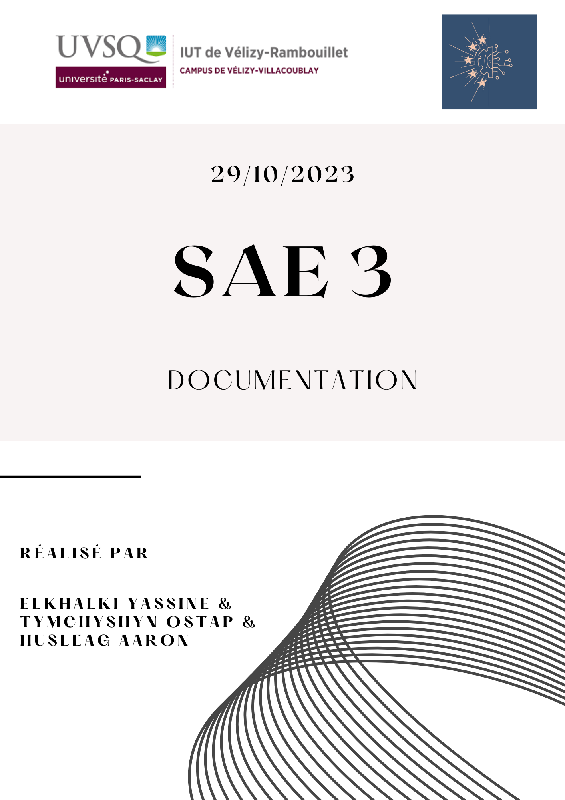

# Sommaire 
1. [Introduction](#Introduction)
    * Contexte
    * But
    * Utilisation sur un environnement classique (ex : XAMP)
    * Utilisation sur le Raspberry PI 4
2. [Site web statique](#Site-web-statique)
    * Explications
    * Structure du site
    * Description des pages
    * Bilan
3. [Deuxième version](#Deuxième-version)
    * Explications
    * Dynamisation du site web statique
    * Implémentations
    * Bilan

## 1. Introduction

### Contexte

>La documentation du projet est un élément essentiel pour comprendre, utiliser et maintenir 
notre Plateforme de Ticketing Interne. Elle offre une vue d'ensemble complète du système, de 
son architecture et de ses fonctionnalités. Ce document est destiné aux membres de l'équipe de 
développement, aux administrateurs système, aux techniciens, ainsi qu'aux utilisateurs finaux, 
afin de faciliter l'utilisation et la gestion de la plateforme.

### But

>Le but de cette documentation est de fournir des informations détaillées sur la conception, 
la mise en œuvre et l'utilisation de la Plateforme de Ticketing Interne. Vous y trouverez des 
instructions sur l'installation du système, des guides d'utilisation, des descriptions des 
fonctionnalités et des informations sur la maintenance. Cette documentation a pour objectif 
de faciliter la prise en main du logiciel, d'assurer sa stabilité et de garantir une expérience 
utilisateur optimale.

### Utilisation sur un environnement classique (ex : XAMPP)

1. **Clonage du Dépôt Git :** Pour accéder au code source et aux fichiers du site, commencez par cloner le dépôt Git associé à ce projet. Utilisez la commande suivante dans votre terminal (ou seulement le lien dans votre IDE) :

**git clone https://github.com/YassouSensai/SAE_APPLICATION_WEB.git**

2. **Configuration de l'Environnement :** Assurez-vous que vous disposez de l'environnement nécessaire, y compris PHP, MySQL et un serveur web tel qu'Apache (**Vous pouvez très bien utiliser le logiciel XAMPP). Suivez les instructions de configuration spécifiques à votre système. ***(Au besoin, un manuel sera mis à votre disposition)***

3. **Création d'un accès à l'application :** Pour simplifier l'accès à l'application, créez un Alias nommé "start" pour démarrer le serveur Apache et accéder directement à l'application depuis votre navigateur. Pour cela, modifiez le fichier de configuration d'Apache ("httpd.conf" situé dans le dossier de configuration de XAMPP XAMPP/apache/conf) et ajoutez l'Alias suivant :

'''
Alias /start "chemin_vers_le_dossier_de_votre_application"
<Directory "chemin_vers_le_dossier_de_votre_application">
    Options Indexes
    Require all granted
</Directory>
'''
Il vous suffit de lancer la page index.html s'il s'agit de la première version, index.php s'il s'agit de la version 2 ou postérieure.

4. **Navigation sur le Site :** Explorez les fonctionnalités du site statique en cliquant sur tous les liens et/ou logos.

>Pour des instructions plus détaillées sur chaque étape, consultez les sections pertinentes de cette documentation. Que vous soyez un utilisateur, un administrateur ou un membre de l'équipe de développement, cette documentation vous guidera tout au long du processus.
Elle sera donc mis à jour à chaque fin de cycle.

### Utilisation sur le Raspberry PI 4

# Site web statique 
***Note : Il s'agit de la première version de l'application. Les données énoncées pourront être modifiées au cours des prochains cycle de vies.***

### Explications
>Afin de mieux connaître les spécifications pour le site web statique, consultez le dossier de spécification ([Specifications.md](Specifications.md))
dans la partie # Premier cycle. Consultez également le dossier de conception ([Conception.md](Conception.md)) dans la partie # Site web statique.
>Vous pourrez aussi visionner le DOM de la page d'accueil.

### Structure du site
Le projet du site web statique se compose de plusieurs pages HTML qui sont liées entre elles. Voici une vue d'ensemble de la structure du projet :

1. `index.html`: Page d'accueil du site.
2. `logo1.html`: Page dédiée à la présentation du logo 1.
3. `logo2.html`: Page dédiée à la présentation du logo 2.
4. `chartegraphique.html`: Page expliquant la charte graphique du site.
5. `connexion.html`: Page de connexion pour les utilisateurs.
6. `css_site_statique.css`: Fichier CSS pour la mise en page et le style du site.
7. `images/`: Dossier contenant les images utilisées sur le site.

### Description des Pages
#### Page d'Accueil (`index.html`)
La page d'accueil est la première page que les visiteurs voient lorsqu'ils accèdent au site. Elle présente une brève introduction au groupe et à l'objectif du site.

#### Page Logo 1 (`logo1.html`)
Cette page est dédiée à la présentation du premier logo. Elle explique les éléments graphiques du logo, les couleurs, et leur signification. De plus, elle détaille l'outil utilisé pour la création du logo.

#### Page Logo 2 (`logo2.html`)
De manière similaire à la page Logo 1, cette page présente le deuxième logo du groupe. Elle explique les éléments graphiques du logo, les couleurs, et leur signification, ainsi que l'outil utilisé pour la création.

#### Page Charte Graphique (`chartegraphique.html`)
La page de la charte graphique détaille les choix de conception pour le site, y compris les couleurs, la typographie, les images, et la mise en page. Elle met en évidence l'importance de maintenir une identité visuelle cohérente.

#### Page de Connexion (`connexion.html`)
La page de connexion permet aux utilisateurs de se connecter à leur compte. Elle comprend un formulaire pour entrer le pseudo et le mot de passe.

### Bilan
Cette documentation fournit un aperçu complet du site web statique, y compris sa structure, sa conception, et les technologies utilisées. Elle peut servir de référence pour la maintenance et les futures mises à jour du site.

# Deuxième version
