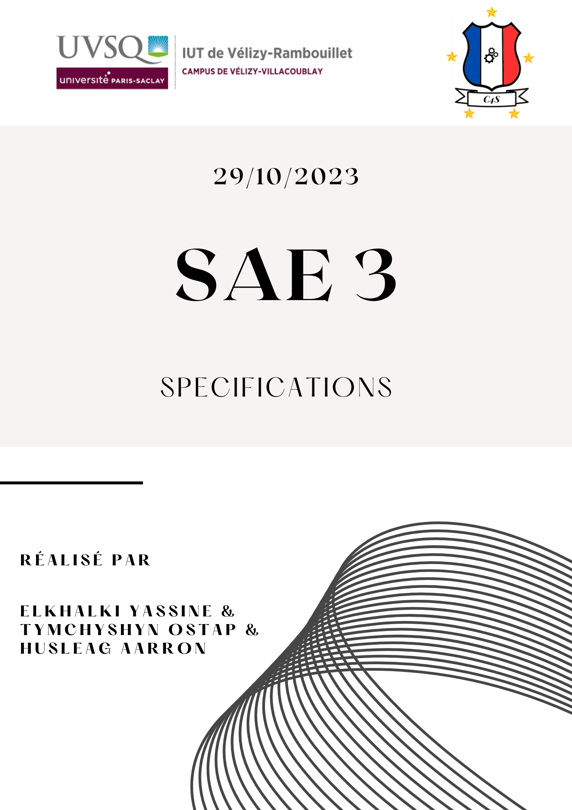

# Sommaire
1. [Introduction](#Introduction)
    * Contexte
    * Objectif
    * Contenu du dossier de spécifications
2. [Premier Cycle](#Premier-Cycle)
3. [Deuxième Cycle](#Deuxième-Cycle)
4. [Troisième Cycle](#Troisième-Cycle)
5. [Quatrième Cycle](#Quatrième-Cycle)

# Introduction

### Contexte

>Ce dossier de spécifications se concentre sur la création d'une plateforme de 
ticketing interne, qui constitue un projet essentiel au cours du semestre 3 de 
notre programme informatique. Ce projet requiert la collaboration de diverses 
ressources interdisciplinaires, couvrant des domaines allant du développement web à 
la gestion de projet, dans le but de mettre en place une solution complète pour 
notre institution.

### Objectif 

>L'objectif principal de ce projet consiste à élaborer et à mettre en place une 
application web en PHP et MySQL conçue pour gérer les requêtes de dépannage au sein 
des installations informatiques de notre institution. La finalité de cette plateforme 
de ticketing est d'optimiser et de rationaliser la gestion des incidents, avec pour 
résultat l'amélioration de l'efficacité du support informatique.

### Contenu du dossier de scpécifications

>Ce projet se divise en plusieurs cycles de vie distincts, suivant la méthodologie 
Scrum. Chaque cycle de vie durera environ 4 semaines et représente une itération du développement de la plateforme 
de ticketing, et ce dossier contient les spécifications détaillées pour chacun de 
ces cycles de vie. Chaque itération est conçue pour apporter des améliorations 
progressives à la plateforme, en réponse aux besoins changeants de nos utilisateurs 
et à l'évolution du projet dans son ensemble.

***Note : Pour chaque cycle de vie, il y aura les sous parties suivantes :***
1. **Détails :** La durée, le but du cycle selon ce qui a été décidé avec le client
2. **Exigences :** Les exigences fonctionnelles et non fonctionnelles pour ce cycle de vie.
3. **Cas d'utilisations :** Les cas d'utilisations qui doivent être implémenté pour la version définitive et qui seront implémenté durant ce cycle de vie
4. **Conclusion :** Une conclusion sur le travail fournit lors de la réalisation de ce cycle de vie.

# Premier Cycle

### Détails

***Nom :*** Lancement du projet et Livraison d'une version minimaliste  
***Début :*** 25 septembre 2023  
***Fin :*** 22 octobre 2023  
***Livraison :*** 23 octobre 2023

>Ce premier cycle de vie, comme son nom l'indique, nous a permis de démarrer le projet
par la rédaction du cahier des charges et du recueil de besoins (document [ici](#Cahier_Des_Charges_et_Recueil_Des_Besoins)).
Ainsi, en accord avec le client, le but de ce premier cycle de vie est de fournir une version minimaliste 
de l'application web qui contient le site web statique avec le travail de communication (sujet [ici](#documents/sujets/sujet_SAE3_communication.pdf))
et, une page de connexion où seulement l'administrateur web pourra se connecter et accèder à sa session (vide pour le moment).

### Exigences

### Cas d'utilisations

### Conclusion pour le premier cycle

