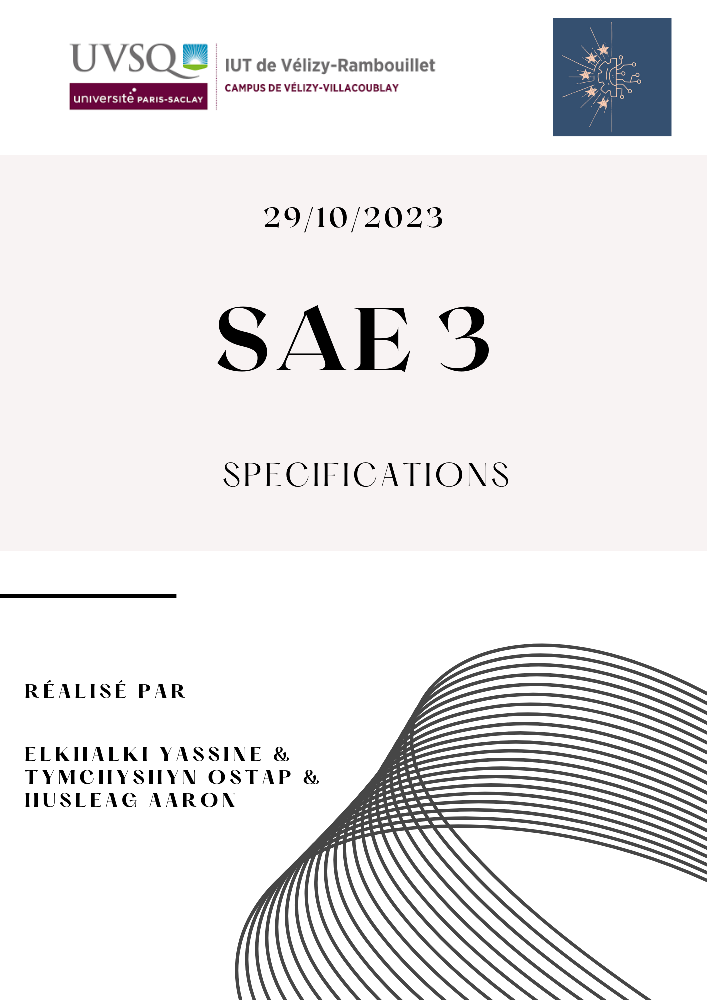

# Sommaire
1. [Introduction](#Introduction)
    * Contexte
    * Objectif
    * Contenu du dossier de spécifications
2. [Premier Cycle : Lancement et maquettes](#Premier-Cycle-:-Lancement-et-maquettes)
3. [Deuxième Cycle](#Deuxième-Cycle)
4. [Troisième Cycle](#Troisième-Cycle)
5. [Quatrième Cycle](#Quatrième-Cycle)

# Introduction

### Contexte

>Ce dossier de spécifications se concentre sur la création d'une plateforme de 
ticketing interne, qui constitue un projet essentiel au cours du semestre 3 de 
notre programme informatique. Ce projet requiert la collaboration de diverses 
ressources interdisciplinaires, couvrant des domaines allant du développement web à 
la gestion de projet, dans le but de mettre en place une solution complète pour 
notre institution.

### Objectif 

>L'objectif principal de ce projet consiste à élaborer et à mettre en place une 
application web en PHP et MySQL conçue pour gérer les requêtes de dépannage au sein 
des installations informatiques de notre institution. La finalité de cette plateforme 
de ticketing est d'optimiser et de rationaliser la gestion des incidents, avec pour 
résultat l'amélioration de l'efficacité du support informatique.

### Contenu du dossier de scpécifications

>Ce projet se divise en plusieurs cycles de vie distincts, suivant la méthodologie 
Scrum. Chaque cycle de vie durera environ 4 semaines et représente une itération du développement de la plateforme 
de ticketing, et ce dossier contient les spécifications détaillées pour chacun de 
ces cycles de vie. Chaque itération est conçue pour apporter des améliorations 
progressives à la plateforme, en réponse aux besoins changeants de nos utilisateurs 
et à l'évolution du projet dans son ensemble.

***Note : Pour chaque cycle de vie, il y aura les sous parties suivantes :***
1. **Détails :** La durée, le but du cycle selon ce qui a été décidé avec le client
2. **Exigences :** Les exigences fonctionnelles et non fonctionnelles pour ce cycle de vie.
3. **Cas d'utilisations :** Les cas d'utilisations qui doivent être implémenté pour la version définitive et qui seront implémenté durant ce cycle de vie
4. **Livrable :** Contenu et forme du livrable pour le cycle de vie.
5. **Bilan :** Une conclusion sur le travail fournit lors de la réalisation de ce cycle de vie.

***Remarque : Pour plus d'informations concernant les exigences et les cas d'utilisations, consultez les cahier des charges et le recueil des besoins [ici](#Cahier_Des_Charges_et_Recueil_Des_Besoins.md)***

# Premier Cycle : Lancement et maquettes

### Détails

***Nom :*** Lancement du projet et Livraison des maquettes au client  
***Début :*** 25 septembre 2023  
***Fin :*** 22 octobre 2023  
***Livraison :*** 23 octobre 2023

>Ce premier cycle de vie, comme son nom l'indique, nous a permis de démarrer le projet
par la rédaction du cahier des charges et du recueil de besoins (document [ici](#Cahier_Des_Charges_et_Recueil_Des_Besoins)).
Ainsi, en accord avec le client, le but de ce premier cycle de vie est de fournir deux maquettes pour la page d'accueil
du site web statique. Notre client choisira l'une des deux maquettes.
Nous fournirons également le travail de communication (sujet [ici](#documents/sujets/sujet_SAE3_communication.pdf)) qui apparaitra dans des pages du site web statique
et, nous fournirons une maquette de la page de connexion.

### Exigences :
Durant ce premier cycle de vie, les principaux impératifs sont les suivants :
- Élaboration du cahier des charges pour énoncer les buts du projet.
- Rassemblement des besoins du client et des parties prenantes.
- Édification de maquettes web pour le site statique.
- Commencer le développement des pages html.

***Remarque : Afin d'avoir plus d'informations sur la conception, consultez le dossier de conception [ici](#Conception.md).***

### Cas d'Utilisation :
Ce cycle de vie s'est caractérisé par les scénarios d'utilisation suivants :
1. **Visualisation de la Page d'Accueil :** Les visiteurs ont eu la possibilité d'accéder à la page d'accueil du site web statique pour se renseigner sur le projet.
2. **Consultation du Contenu de Communication :** Les utilisateurs ont pu consulter le matériel de communication pour obtenir une meilleure compréhension des objectifs du projet.
3. **Connexion de l'Administrateur Web :** L'administrateur web a eu la capacité de se connecter à son espace, même si cette fonctionnalité restait inopérante à ce stade initial.

### Livrable :
Le livrable à la fin du cycle de vie sera le support du projet, soit, la carte SD. Son contenu est le suivant :
1. L'OS (Operating System), ici Raspberry PI OS.
2. Le serveur web APACHE
3. Le code source de l'application.

### Bilan :
Ce premier cycle de vie s'est avéré fondamental pour établir les bases du projet. L'élaboration du cahier des charges et la collecte des besoins ont permis de définir clairement les objectifs du projet. La création de la page d'accueil et du volet communication a fourni une vitrine pour le projet, tandis que l'introduction de la page de connexion a permis de projeter les bases de l'authentification.

Il s'agit de la première itération de l'application web, qui sera développée davantage au cours des cycles de vie ultérieurs. Ce cycle de vie a jeté les fondements pour la suite du projet en fournissant une version minimale de l'application et en éclaircissant les besoins du client. Il nous permettra de progresser et d'ajouter des fonctionnalités au fur et à mesure que le projet avancera.
  

